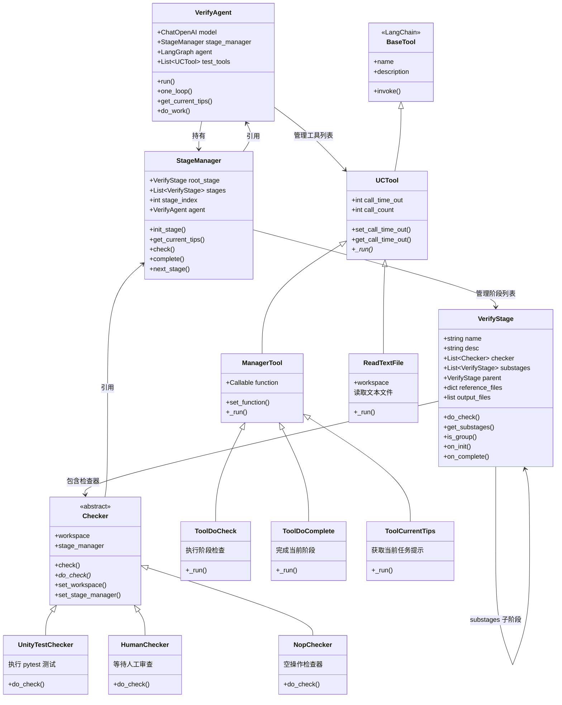

# 核心类实现

**省流版**：

本文深入解析 UCAgent 的核心类源码设计，包括五个核心类：
- **VerifyAgent**（`verify_agent.py:40`）：
  - 协调整个验证流程
  - 管理 LLM 模型和工具
  - 控制 ReAct 循环
- **StageManager**（`stage/vmanager.py:234`）：
  - 解析和管理 Stage 配置
  - 控制阶段切换
  - 提供任务管理工具（Check、Complete）
- **VerifyStage**（`stage/vstage.py:28`）：
  - 表示一个验证阶段
  - 管理参考文件和输出文件
  - 执行 Checker 验证，支持嵌套子阶段
- **Checker 基类**（`checkers/base.py`）：
  - 定义检查接口
  - UnityTestChecker 执行 pytest
  - HumanChecker 等待人工审查
- **UCTool 基类**（`tools/uctool.py`）：
  - 所有工具的基类
  - 提供工作空间引用和超时管理

最后给出类关系图，展示各类之间的依赖关系。

---

## 1. VerifyAgent 类

**位置**：`verify_agent.py:40`

```python
class VerifyAgent:
    """AI-powered hardware verification agent for chip design testing."""
```

**核心职责**：
- 协调整个验证流程
- 管理 LLM 模型和工具
- 控制 ReAct 循环
- 处理消息历史

### 1.1 关键属性

```python
# 配置和模型
self.cfg                    # 配置对象
self.model                  # LLM 模型（ChatOpenAI）
self.sumary_model           # 摘要模型

# 工具列表
self.tool_list_base         # 基础工具（ReadTextFile, RoleInfo等）
self.tool_list_file         # 文件操作工具
self.tool_list_task         # 任务管理工具（Check, Complete等）
self.tool_list_ext          # 外部工具
self.test_tools             # 所有工具的合集

# 管理器
self.stage_manager          # 阶段管理器
self.agent                  # LangGraph ReAct Agent

# 消息管理
self.message_manage_node    # 消息压缩节点
self.message_statistic      # 消息统计

# 状态标志
self._is_exit               # 是否退出
self._need_break            # 是否需要中断
self._need_human            # 是否需要人工输入
self.invoke_round           # 执行轮次
```

### 1.2 核心方法

#### run() - 启动验证

**位置**：`verify_agent.py:522-525`

```python
def run(self):
    self.pre_run()      # 预处理
    self.run_loop()     # 主循环
```

#### one_loop() - 执行一轮

**位置**：`verify_agent.py:554-592`

```python
def one_loop(self, msg=None):
    # 1. 根据交互模式选择逻辑
    if self.interaction_mode == "advanced":
        return self.advanced_logic.advanced_one_loop(msg)
    elif self.interaction_mode == "enhanced":
        return self.enhanced_logic.enhanced_one_loop(msg)

    # 2. 标准模式
    while True:
        tips = self.get_current_tips()
        self.do_work(tips, self.get_work_config())
        if not self._tool__call_error:
            break

    self.invoke_round += 1
```

#### get_current_tips() - 获取任务提示

**位置**：`verify_agent.py:451-466`

```python
def get_current_tips(self):
    # 1. 检查工具调用错误
    if self._tool__call_error:
        return {"messages": copy.deepcopy(self._tool__call_error)}

    # 2. 获取当前阶段提示
    tips = self._continue_msg or yam_str(self.stage_manager.get_current_tips())

    # 3. 构造消息
    msg = []
    if self._system_message:
        msg.append(SystemMessage(content=self._system_message))
    msg.append(HumanMessage(content=tips))

    return {"messages": msg}
```

---

## 2. StageManager 类

### 2.1 类定义

**位置**：`stage/vmanager.py:234`

```python
class StageManager(object):
    def __init__(self, workspace, cfg, agent, tool_read_text, ucagent_info, ...):
        """管理多个验证阶段的执行"""
```

**核心职责**：
- 解析和管理 Stage 配置
- 控制阶段切换
- 提供任务管理工具（Check, Complete等）
- 维护验证进度

### 2.2 关键属性

```python
self.cfg                    # 配置对象
self.workspace              # 工作目录
self.agent                  # VerifyAgent 引用

# Stage 管理
self.root_stage             # 根 Stage（树结构）
self.stages                 # 扁平化的 Stage 列表（只包含叶子节点）
self.stage_index            # 当前阶段索引

# 状态
self.mission                # 任务信息
self.last_check_info        # 最后一次检查结果
self.all_completed          # 是否全部完成
```

### 2.3 核心方法

#### init_stage() - 初始化阶段

**位置**：`vmanager.py:261-310`

```python
def init_stage(self):
    # 1. 解析 Stage 配置
    self.root_stage = get_root_stage(self.cfg, self.workspace, self.tool_read_text)

    # 2. 扁平化（只保留叶子节点）
    self.stages = self.root_stage.get_substages()

    # 3. 添加参考文件
    if self.reference_files:
        for si, flist in self.reference_files.items():
            self.stages[si].add_reference_files(flist)

    # 4. 恢复历史状态
    for stage_idx, stage_info in stages_info.items():
        stage.set_fail_count(stage_info["fail_count"])
        stage.set_time_prev_cost(stage_info["time_cost"])

    # 5. 设置当前阶段
    self.stage_index = force_stage_index
    self.stages[self.stage_index].on_init()
```

#### get_current_tips() - 获取当前任务

**位置**：`vmanager.py:349-368`

```python
def get_current_tips(self):
    if self.stage_index >= len(self.stages):
        return "Your mission is completed..."

    cstage = self.stages[self.stage_index]
    tips = OrderedDict()
    tips["mission"] = self.mission.name
    tips["current_stage"] = {
        "index": self.stage_index,
        **cstage.detail(),  # task, reference_files, output_files
    }

    # 提示需要读取的参考文件
    ref_files = [k for k, v in cstage.reference_files.items() if not v]
    if ref_files:
        tips["notes"] = f"You need use tool: {self.tool_read_text.name}..."

    tips["process"] = f"{self.stage_index}/{len(self.stages)}"
    return make_llm_tool_ret(tips)
```

#### check() - 执行检查

**位置**：`vmanager.py:447-463`

```python
def check(self, timeout):
    # 1. 执行当前阶段的检查
    ck_pass, ck_info = self.stages[self.stage_index].do_check(timeout=timeout)

    # 2. 构造返回结果
    ret_data = OrderedDict({
        "check_info": ck_info,
        "check_pass": ck_pass,
    })

    if not ck_pass:
        ret_data["action"] = "Please fix the issues..."
    else:
        ret_data["message"] = "Congratulations! You can use 'Complete'..."

    self.last_check_info = copy.deepcopy(ret_data)
    return ret_data
```

#### complete() - 完成阶段

**位置**：`vmanager.py:522-558`

```python
def complete(self, timeout):
    # 1. 执行最终检查
    ck_pass, ck_info = self.stages[self.stage_index].do_check(
        timeout=timeout,
        is_complete=True
    )

    if ck_pass:
        # 2. 完成当前阶段
        self.stages[self.stage_index].on_complete()

        # 3. 进入下一阶段
        self.next_stage()

        if self.stage_index >= len(self.stages):
            message = "All stages completed successfully..."
            self.all_completed = True
        else:
            message = f"Current stage index is now {self.stage_index}..."
            self.stages[self.stage_index].set_reached(True)
            self.stages[self.stage_index].on_init()
    else:
        message = "Stage not completed..."

    return {"complete": ck_pass, "message": message}
```

---

## 3. VerifyStage 类

### 3.1 类定义

**位置**：`stage/vstage.py:28`

```python
class VerifyStage(object):
    def __init__(self, cfg, workspace, name, description, task,
                 checker, reference_files, output_files,
                 prefix="", skip=False, tool_read_text=None, substages=None):
        """初始化验证阶段"""
```

**核心职责**：
- 表示一个验证阶段
- 管理参考文件和输出文件
- 执行 Checker 验证
- 支持嵌套子阶段

### 3.2 关键属性

```python
# 基本信息
self.name                   # 阶段名称
self.desc                   # 阶段描述
self.prefix                 # 索引前缀（如 "1.2"）
self.task_list              # 任务列表

# Checker 管理
self.checker                # Checker 实例列表
self.check_size             # Checker 数量
self.check_info             # 检查结果信息
self.check_pass             # 是否通过检查

# 文件管理
self.reference_files        # {文件路径: 是否已读}
self.output_files           # 输出文件模式列表

# 阶段树结构
self.substages              # 子阶段列表
self.parent                 # 父阶段

# 状态
self._is_reached            # 是否已到达
self.fail_count             # 失败次数
self.succ_count             # 成功次数
```

---

### 3.3 核心方法

#### do_check() - 执行检查

**位置**：`vstage.py:242-283`

```python
def do_check(self, *a, **kwargs):
    self._is_reached = True

    # 1. 检查参考文件是否都已读
    if not all(v for v in self.reference_files.values()):
        emsg = {"error": "You need to read reference files", "files_need_read": [...]}
        self.fail_count += 1
        return False, emsg

    # 2. 检查输出文件是否生成
    for pattern in self.output_files:
        if len(find_files_by_pattern(self.workspace, pattern)) <= 0:
            self.fail_count += 1
            return False, {"error": "Output files not found", "failed_patterns": [...]}

    # 3. 执行所有 Checker
    self.check_pass = True
    for i, checker in enumerate(self.checker):
        ck_pass, ck_msg = checker.check(*a, **kwargs)

        # 更新检查信息
        self.check_info[i] = {
            "name": checker.__class__.__name__,
            "count_pass": ...,
            "count_fail": ...,
            "last_msg": ck_msg,
        }

        if not ck_pass:
            self.check_pass = False
            self.fail_count += 1

    if self.check_pass:
        self.succ_count += 1

    return self.check_pass, self.check_info
```

#### get_substages() - 扁平化子阶段

**位置**：`vstage.py:300-306`

```python
def get_substages(self) -> list[Self]:
    ret = []
    # 递归收集所有子阶段
    for s in self.substages:
        ret.extend(s.get_substages())

    # 如果不是组阶段，添加自己
    if not self.is_group():
        ret.append(self)

    return ret

def is_group(self):
    # 组阶段：无checker、无output_files、有子阶段
    return (self.check_size == 0 and
            len(self.output_files) == 0 and
            len(self.reference_files) == 0 and
            len(self.substages) > 0)
```

---

## 4. Checker 基类

### 4.1 UCChecker 基类

**位置**：`checkers/base.py`

```python
class UCChecker:
    """所有 Checker 的基类"""

    def __init__(self, name, cfg):
        self.name = name
        self.cfg = cfg
        self.workspace = None
        self.stage_manager = None

    def set_workspace(self, workspace):
        self.workspace = workspace
        return self

    def set_stage_manager(self, manager):
        self.stage_manager = manager
        return self

    def check(self, *args, **kwargs):
        """执行检查，返回 (pass_flag, message)"""
        raise NotImplementedError

    def do_check(self, *args, **kwargs):
        """实际的检查逻辑"""
        raise NotImplementedError
```

**核心职责**：
- 定义 Checker 接口
- 提供工作空间和管理器引用
- 子类实现具体检查逻辑

### 4.2 UnityTestChecker

**位置**：`checkers/base.py`

**功能**：执行 pytest 测试并检查结果

```python
class UnityTestChecker(UCChecker):
    def do_check(self, pytest_args="", timeout=0, return_line_coverage=False):
        # 1. 执行 pytest
        result = subprocess.run(
            ["pytest", test_dir, pytest_args],
            capture_output=True,
            timeout=timeout
        )

        # 2. 解析测试结果
        if result.returncode == 0:
            return True, {"status": "All tests passed", "coverage": ...}
        else:
            return False, {"status": "Tests failed", "error": ...}
```

### 4.3 HumanChecker

**位置**：`checkers/base.py`

**功能**：等待人工审查

```python
class HumanChecker(UCChecker):
    def check(self, *args, **kwargs):
        if self._human_check_result is None:
            # 设置需要人工输入标志
            self.stage_manager.agent._need_human = True
            return False, {"status": "Waiting for human review"}

        # 返回人工审查结果
        return self._human_check_result
```

---

## 5. UCTool 基类

### 5.1 类定义

**位置**：`tools/uctool.py`

```python
class UCTool(BaseTool):
    """所有工具的基类，继承自 LangChain BaseTool"""

    workspace: str = ""
    call_time_out: int = 300

    def set_call_time_out(self, time_out: int):
        self.call_time_out = time_out
        return self

    def get_call_time_out(self):
        return self.call_time_out
```

**核心职责**：
- 提供工作空间引用
- 管理工具调用超时
- 继承 LangChain 工具接口

---

## 6. 类关系图



