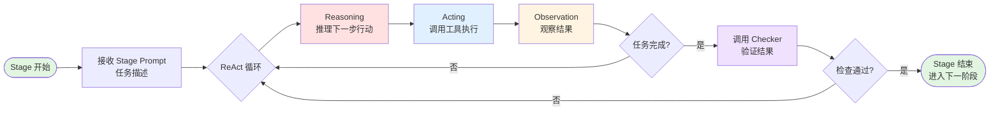

# UCAgent 源码学习笔记

> 本笔记带大家深入理解 UCAgent 的源码、算法

---

## UCAgent 是什么

**UCAgent** 是一个基于大语言模型（LLM）的硬件验证自动化工具，专门用于 RTL（寄存器传输级）设计的自动化测试和验证。它通过 AI Agent 自动完成从环境搭建、测试用例编写到验证执行的完整流程，大幅降低硬件验证的人工成本。

> **重要说明**：本笔记专注于 UCAgent 的**源码学习和架构分析**。如需开发或使用 UCAgent，请参考官方仓库和开发者手册。

UCAgent源码：https://github.com/XS-MLVP/UCAgent

UCAgent开发者手册：https://ucagent.open-verify.cc/

LangGraph：https://langgraph.readthedocs.io/en/latest/

## 🔆 一段话说明UCAgent

**UCAgent = LLM + 测试框架**，底层验证和测试用的是 toffee 等工具链。

UCAgent 首先用 YAML 配置文件规范了测试的整个流程，分成了诸多 Stage，每个 Stage 都有详细的描述（作为 LLM 的 Prompt）。运行时从头执行到尾，即为完成一次验证。

对于每个 Stage，会启动 Agent（Agent = LLM + 工具），并赋予相关的 Prompt，指导完成本次 Stage 的任务。Agent 会以 ReAct 模式（推理 → 行动，不断重复，直至结束），调用文件处理工具、硬件验证工具链（toffee）。完成任务后，会按照 Prompt 的指引，调用 Checker（包括 pytest 和人为 check 等），如果通过则表示本 Stage 完成。

> 用户参与的部分：1. 编写 Stage 的 YAML 配置文件（UCAgent 已提供默认的）；2. 人工 check 部分。

---

## 核心理念

由于在 Agent 项目中，大量设计均是以 Prompt 的形式存在，因此解读 UCAgent 要围绕**源码部分**和**Prompt部分**这两个方面展开。

**源码部分**（详见 [00-core-concepts.md](./00-core-concepts.md)）：
- **Stage**（流程编排）：通过 YAML 配置定义验证流程
- **Agent**（执行引擎）：LLM + LangGraph ReAct 框架
- **Checker**（验证机制）：pytest、bash 脚本、人工审查

**Prompt部分**（详见 [02-prompt-engineering.md](./02-prompt-engineering.md)）：
- **System Prompt**（角色定义）：定义 LLM 的角色、目标、工作方式
- **Stage Task Prompt**（任务细节）：每个 Stage 的具体任务描述

---

## 学习路径

按顺序阅读以下笔记，从核心概念到底层实现：

### 0. 核心概念
**[00-core-concepts.md](./00-core-concepts.md)**
- UCAgent 架构与三大核心：Stage、Agent、Checker
- LangGraph ReAct 框架与执行机制
- Stage 配置解析与执行控制
- 完整工作流程

### 1. 技术栈详解
**[01-technology-stack.md](./01-technology-stack.md)**
- 5层架构：应用层 → LangGraph → LLM → pytest+toffee → Verilator
- 各层技术选型与协同机制

### 2. Prompt 工程
**[02-prompt-engineering.md](./02-prompt-engineering.md)**
- System Prompt 设计：角色、目标、工作流程
- Stage Task Prompt 动态生成
- Bug 发现引导机制

### 3. 关键算法
**[03-key-algorithms.md](./03-key-algorithms.md)**
- Stage 递归解析（vstage.py:367-404）
- Stage 树扁平化（vstage.py:300-306）
- 批处理任务管理

### 4. 执行流程
**[04-execution-flow.md](./04-execution-flow.md)**
- 启动到完成的完整调用链
- ReAct 循环与 Checker 执行

### 5. 核心类实现
**[05-core-classes.md](./05-core-classes.md)**
- VerifyAgent、StageManager、VerifyStage
- Checker 基类与工具系统

---

## 开始学习

从 [00-core-concepts.md](./00-core-concepts.md) 开始，核心概念部分。
